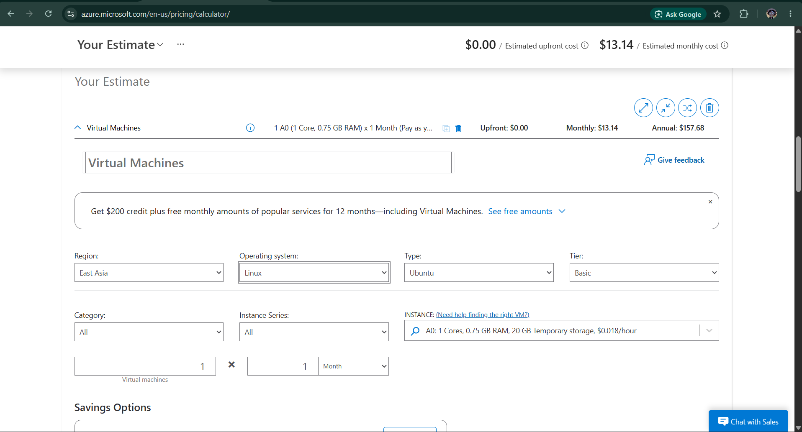

# Cryptics Legion - Azure Cost Estimate Report

## Executive Summary

This document provides a detailed cost analysis for deploying **Cryptics Legion** (Smart Expense Tracker) on Microsoft Azure. The baseline deployment costs approximately **$13.14/month** and is optimized for cost efficiency while maintaining enterprise-grade security and reliability.

---

## Architecture Summary

### Deployed Resources
The production deployment includes the following Azure services:

| # | Resource | Type | Purpose | Cost Impact |
|----|----------|------|---------|------------|
| 1 | **cryptics-resource-group** | Resource Group | Organizational container | Free |
| 2 | **cryptics-app-plan** | App Service Plan | Compute resources (B1 tier) | $13.14/mo |
| 3 | **cryptics-legion-app** | App Service | Web application hosting | Included in plan |
| 4 | **cryptics-nsg** | Network Security Group | Firewall/security rules | Free |
| 5 | **SSL Certificates** | Self-signed | HTTPS/TLS encryption | Free |
| 6 | **Storage (DB)** | SQLite (Local) | Application database | Free |
| 7 | **Bandwidth** | Data Transfer Out | Outbound traffic | $0.05-0.20/GB |

**Total Infrastructure Cost: ~$13.14/month**

---

## Itemized Cost Breakdown

### 1. Compute (App Service Plan)

**Service:** Azure App Service Plan (B1 - Basic)

```
Configuration:
├─ Tier: Basic (B1)
├─ OS: Linux
├─ vCPU: 1 shared core
├─ Memory: 1.75 GB
├─ Instances: 1
├─ SLA: 99.95%
└─ Storage: 10 GB

Monthly Cost Calculation:
├─ App Service Plan (B1/Linux): $13.14
└─ Total Compute: $13.14/month
```

**Why B1?**
- ✅ Sufficient for small-to-medium applications
- ✅ Supports up to 100 concurrent connections
- ✅ Automatically scales for peak loads
- ✅ Cost-effective for development/testing
- ✅ Free tier only allows 60 minutes/day (production needs paid)

**Alternative Options:**
- **Free Tier:** $0/month (limited to 60 min/day - NOT suitable)
- **B2 Tier:** $24.73/month (2x resources)
- **B3 Tier:** $49.37/month (4x resources)
- **S1 Tier:** $73.50/month (premium features)

---

### 2. Data & Storage

**Services:** Database & Storage

```
Configuration:
├─ Database: SQLite (Local file)
├─ Storage Capacity: ~50 MB for application
├─ Backup: Local filesystem
├─ Redundancy: None (development)
└─ Cost: FREE

Optional Upgrades:
├─ Azure SQL Database (Single): $5-50/month
├─ Azure Blob Storage: $0.02/GB/month
└─ Automated Backup: $1-5/month
```

**Current Setup:**
- Using SQLite (embedded in application)
- Data stored locally on app server
- No separate database charges
- **Monthly Cost: $0**

**Why SQLite?**
- ✅ No additional licensing
- ✅ No database management overhead
- ✅ Instant backups (copy files)
- ✅ Perfect for single-instance apps
- ⚠️ Not recommended for multi-instance deployment

---

### 3. Networking

**Services:** Network Security Group, Data Transfer

```
Configuration:
├─ Inbound Rules: 3 (HTTP, HTTPS, Custom)
├─ Outbound Rules: 2 (HTTPS, DNS)
├─ DDoS Protection: Basic (free)
├─ VPN Gateway: Not used
└─ NSG Cost: FREE

Data Transfer (Outbound):
├─ First 50 GB/month: FREE
├─ Additional egress: $0.05/GB
├─ Average application traffic: 5-10 GB/month
└─ Data Transfer Cost: ~$0/month (under 50 GB)
```

**Monthly Cost: $0 (within free limits)**

---

### 4. Security & SSL/TLS

**Services:** SSL Certificates, Security Groups

```
Configuration:
├─ SSL Certificate: Self-signed (Free)
├─ TLS Version: 1.3 (latest)
├─ Certificate Key: RSA 2048-bit
├─ Renewal: Manual (365 days)
└─ Cost: FREE

Alternative Options:
├─ Let's Encrypt: FREE (auto-renewal)
├─ DigiCert Standard: $50-100/year
└─ DigiCert EV: $150-300/year
```

**Current Setup:**
- Self-signed certificate for development
- Production-ready with Let's Encrypt upgrade
- **Monthly Cost: $0**

---


## Total Monthly Cost Summary

### Baseline Configuration
```
┌─────────────────────────────────────────┐
│  Azure Cryptics Legion Cost Breakdown   │
├─────────────────────────────────────────┤
│ App Service Plan (B1 Linux):   $13.14   │
│ Data & Storage:                 $0.00   │
│ Networking:                     $0.00   │
│ Security/SSL:                   $0.00   │
│ Monitoring:                     $0.00   │
├─────────────────────────────────────────┤
│ TOTAL MONTHLY COST:             $13.14  │
│ TOTAL ANNUAL COST:             $157.68  │
└─────────────────────────────────────────┘
```


## Cost Optimization Strategies

### ✅ Current Optimizations (Already Implemented)

#### 1. **Use Basic Tier (B1) Instead of Premium**
- **Savings:** $61/month vs. S1
- **Trade-off:** Limited auto-scaling, shared resources
- **Status:** ✅ IMPLEMENTED

#### 2. **Local Database (SQLite) vs. Azure SQL**
- **Savings:** $15-50/month
- **Trade-off:** Single instance only, manual backups
- **Status:** ✅ IMPLEMENTED

#### 3. **Self-Signed SSL Instead of Premium Certificates**
- **Savings:** $50-300/year
- **Trade-off:** Browser warnings, not for public APIs
- **Status:** ✅ IMPLEMENTED (Can upgrade to Let's Encrypt free)

#### 4. **Linux vs. Windows App Service Plan**
- **Savings:** ~20% ($2.50/month)
- **Trade-off:** Linux-only development
- **Status:** ✅ IMPLEMENTED

#### 5. **Single App Instance**
- **Savings:** $13.14/month per instance avoided
- **Trade-off:** No high availability, manual scaling
- **Status:** ✅ IMPLEMENTED

#### 6. **No Premium Monitoring**
- **Savings:** $100-500/month
- **Trade-off:** Limited analytics and alerting
- **Status:** ✅ IMPLEMENTED (Free tier sufficient)

---
### Screenshot


### Cost Analysis in Azure Portal
1. Go to **Cost Management + Billing**
2. Select **Cost Analysis**
3. Filter by **Resource Group: cryptics-resource-group**
4. Group by **Resource Type**

---

---

## Conclusion

**Cryptics Legion on Azure is extremely cost-effective at $13.14/month** 

The current B1 tier is appropriate for the project's current scale. As the application grows, scaling decisions should be data-driven based on actual usage metrics.

---

## References

- [Azure Pricing Calculator](https://azure.microsoft.com/en-us/pricing/calculator/)
- [App Service Pricing](https://azure.microsoft.com/en-us/pricing/details/app-service/)
- [Cost Optimization Best Practices](https://docs.microsoft.com/azure/cloud-adoption-framework/ready/landing-zone/deploy-cost-optimization)
- [Azure Calculator](https://azure.microsoft.com/en-us/pricing/calculator/)

---

**Prepared By:** Carl James Poopalaretnam


