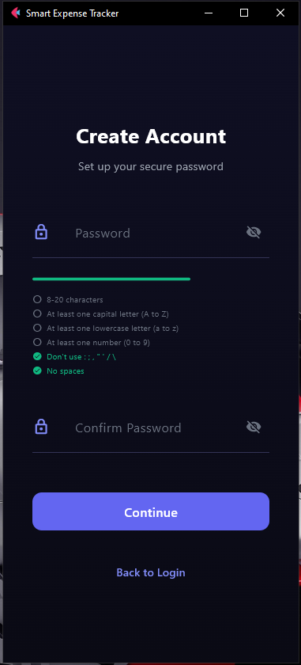

# 🖼️ Assets

Images, screenshots, and supporting files for documentation.

## 📁 Contents

- **image*.png** - Screenshots and diagrams (25 images)
- **FINAL REPORT_INFOASSUR.pdf** - Final project report

## 🖼️ How to Reference

In markdown files, reference images like:
```markdown

```

Or use relative paths from documentation:
```markdown

```

## 📊 Image Index

| Image | Used In |
|-------|---------|
| image-1.png - image-25.png | Various documentation |
| FINAL REPORT_INFOASSUR.pdf | Project final report |

---

*Assets organized by type for easy reference throughout documentation*
